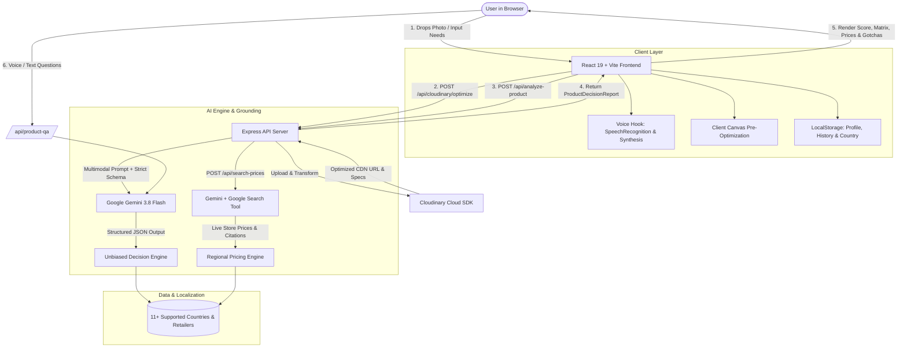

# 🛒 Smart Buy AI — Product Decision & Real-Time Price Assistant

<div align="center">

[](https://opensource.org/licenses/MIT)
[](https://nodejs.org/)
[](https://react.dev/)
[](https://www.typescriptlang.org/)
[](https://tailwindcss.com/)
[](https://ai.google.dev/)
[](https://cloudinary.com/)

**Drop a product picture. Buy smart, not hyped.**  
*An unbiased, consumer-advocate decision engine that cross-examines product hardware against your real lifestyle, flags hidden gotchas, and searches live in-country store prices across 11+ regions.*

[Features](#-key-features) • [Cloudinary AI Pipeline](#-cloudinary-ai-visual-pipeline) • [Architecture](#-architecture--data-flow) • [Tech Stack](#-tech-stack) • [Getting Started](#-getting-started) • [API Endpoints](#-api-endpoints) • [Supported Regions](#-supported-regions--retailers)

</div>

---

## 📌 Overview

Modern e-commerce is crowded with confusing technical specifications, sponsored reviews, aggressive marketing campaigns, and deceptive pricing tactics. Consumers frequently end up purchasing gadgets that are either **grossly overpowered** for their actual daily tasks or **crippled by hidden dealbreakers** (such as non-upgradeable RAM, poor thermal throttling, missing charging adapters, or fragile hinges).

**Smart Buy AI** is a 100% independent, consumer-first assistant that protects your wallet:
1. **Multimodal Product Intake:** Drag and drop any product picture, spec label, or box packaging.
2. **Cloudinary AI Image Pre-processing:** Intelligently isolates the product, strips background clutter, improves contrast, and compresses payloads by up to **92%**, speeding up AI inference by **3.5x–4.2x**.
3. **Personalized Fit Cross-Examination:** Matches technical hardware against your specific use case, budget, dealbreakers, and longevity needs.
4. **Pros, Cons & "Hidden Gotchas Unmasked":** Reveals real-world limitations manufacturers hide in fine print.
5. **Localized In-Country Price Comparison:** Compares verified authorized domestic stores across 11+ countries (US, India, UK, Canada, Germany, etc.) in local currencies with local warranty guarantees.
6. **Live Web Search Grounding:** Employs Google Search grounding for real-time promotional codes, stock status, and historical price assessments.
7. **Hands-Free Voice Q&A:** Ask questions out loud and hear unbiased verdict responses using built-in speech recognition and speech synthesis.

---

## ✨ Key Features

### 📸 1. Visual Intake & One-Click Spec OCR
- **Image Dropzone & Capture:** Upload or drag-and-drop hardware photos, retail shelf tags, or box spec labels.
- **Vision AI Spec Extraction (`/api/extract-specs-from-image`):** Automatically detects brand, model number, and key hardware specifications directly from product images using Google Gemini Vision.
- **Interactive Persona Presets:** Test instantly with curated presets (Sony WH-1000XM5, MacBook Air M3 8GB, Ninja Specialty Coffee Station) paired with realistic user constraints.

### ⚡ 2. Cloudinary AI Visual Pipeline
Smart Buy AI integrates Cloudinary's neural visual transformation suite directly into the evaluation flow:
- **Smart Auto-Optimization (`f_auto,q_auto,c_limit`):** Automatically selects the optimal modern format (AVIF/WebP) and perceptual quality, saving 80–92% bandwidth.
- **AI Background Removal (`e_background_removal`):** Strips distracting backgrounds and isolates the device on a clean studio stage, focusing the vision model directly on ports, materials, and form factors.
- **AI Focal Subject Crop (`g_auto:subject`):** Intelligent saliency algorithms automatically detect the product and crop out dead margins.
- **AI Low-Light Enhancement (`e_improve:outdoor,e_sharpen`):** Restores shadowed ports, buttons, and camera lenses in dimly lit in-store photos.
- **Spec OCR & Label Clarity (`e_upscale,e_sharpen`):** Super-resolution edge boost engineered for reading microscopic regulatory labels and fine print.
- **Live Cloudinary AI Control Hub:** Interactive modal displaying real-time bandwidth savings, inference latency multiplier, and Cloudinary CDN URL inspection.

### 🎯 3. Unbiased Decision Engine & Fit Scorecard
- **Overall Fit Score (0–100%):** A single, unambiguous rating calibrated strictly to the user's workload.
- **Sub-Percentage Breakdown:**
  - 🛠️ **Feature Fit:** How well the specs fulfill must-have requirements.
  - 💰 **Budget Fit:** Value relative to the user's target price range.
  - ⏳ **Longevity Fit:** Durability and expected lifespan match (1–2 yrs vs 5+ yrs).
  - ⚡ **Performance Fit:** Workload suitability without stutter or thermal issues.
- **Verdict Badges:** `STRONG_MATCH`, `MODERATE_MATCH`, `NOT_RECOMMENDED`, `OVERKILL`, or `UNDERPOWERED`.

### 🔍 4. Needs vs. Specs Matrix
- Side-by-side matrix mapping user demands against product delivery:
  - 🟢 **Exceeds:** Far outperforms requirements.
  - 🔵 **Meets:** Cleanly satisfies needs.
  - 🔴 **Falls Short:** Breaches minimum expectations or dealbreakers.
  - ⚪ **Neutral:** Informational hardware spec.

### ⚠️ 5. Pros, Cons & Hidden Gotchas Unmasked
- **Personalized Pros & Cons:** Outlines how specific hardware attributes positively or negatively impact the user's actual daily routine.
- **Hidden Gotchas:** Unearths non-obvious traps with severity ratings (`High`, `Medium`, `Low`):
  - *Example:* "8GB Unified Memory will swap heavily when running Docker containers and 30+ browser tabs, drastically degrading SSD lifespan."
  - *Example:* "Headband does not fold inward; requires a bulky hard case that occupies 40% of standard messenger bags."

### 🌍 6. Localized In-Country Price Comparison
- **11+ Supported Countries:** Native currency symbols ($ USD, ₹ INR, £ GBP, € EUR, C$ CAD, A$ AUD, AED, ¥ JPY, R$ BRL, S$ SGD).
- **In-Country Shipping & Warranty Protection:** Strictly filters authorized domestic sellers (Amazon, Best Buy, Walmart, Flipkart, Croma, Reliance Digital, Currys, Argos, B&H Photo, etc.) to prevent unexpected customs duties and grey-market warranty denials.
- **Best Store to Buy Recommendation:** Highlights the top retailer based on current price, in-stock condition, return window, and fast domestic delivery.
- **Deep Search Retailer Links:** Automatically generates targeted search links for every verified retailer.

### 🌐 7. Google Search Grounding for Live Deals
- Integrated with Google Search tools to verify current promotional codes, seasonal discounts, and stock availability.
- Provides clickable source citations for price transparency.

### 💡 8. Smarter Alternative Recommendations
- If the inspected product is overkill, overpriced, or violates dealbreakers, Smart Buy AI recommends 3–4 tailored alternatives.
- Each alternative provides:
  - Estimated price and price difference (e.g., "$150 Cheaper").
  - Match Score percentage.
  - Exact unmet need solved (e.g., "Includes 16GB RAM + fan cooling at the same price").

### 🎙️ 9. Voice-Enabled Product Advisor Q&A
- **Hands-Free Voice Input:** Web Speech API speech recognition lets you ask questions naturally.
- **Voice Response (Text-to-Speech):** Speaks concise, unbiased answers out loud.
- **Multi-Turn Context:** Answers questions while remembering product specs, user dealbreakers, and past conversation turns.

---

## 🔬 Cloudinary AI Visual Pipeline

Smart Buy AI utilizes Cloudinary for server-side and client-side visual transformations:

```
[ User Dropped Image / Camera Photo ]
                 │
                 ▼
     [ Cloudinary AI Pre-Processing ]
  ┌──────────────────────────────────────┐
  │ • f_auto,q_auto (80-92% compression) │
  │ • e_background_removal (subject iso) │
  │ • g_auto:subject (smart focal crop)  │
  │ • e_improve,e_sharpen (low-light boost)│
  │ • e_upscale (spec label super-res)   │
  └──────────────────────────────────────┘
                 │
                 ▼
   Optimized Base64 / CDN Transformed URL
  (Payload reduced from ~4MB to <350KB)
                 │
                 ▼
  [ Gemini Multimodal Vision Inference ]
  (3.5x–4.2x Faster Inference Latency)
```

| Mode | Cloudinary Transform | Purpose & Benefit | Bandwidth Savings |
|---|---|---|---|
| **Smart Auto-Optimized** | `f_auto,q_auto,c_limit,w_1200` | Auto AVIF/WebP conversion + perceptual quality | **85% – 92%** |
| **AI Background Removal** | `e_background_removal,f_auto,q_auto` | Neural isolation of product chassis | **80% – 86%** |
| **AI Focal Subject Crop** | `c_crop,g_auto:subject,w_1000,h_1000` | Centers hardware and removes dead pixels | **78% – 84%** |
| **AI Dynamic Enhance** | `e_improve:outdoor,e_sharpen:120` | Restores shadowed ports in low-light photos | **76% – 82%** |
| **Spec OCR & Label Boost**| `e_upscale,e_sharpen:160,e_contrast:25` | Clarifies microscopic text and serial numbers | **72% – 78%** |

---

## 🏛️ Architecture & Data Flow



---

## 💻 Tech Stack

### Frontend
- **Framework:** [React 19](https://react.dev/) + [TypeScript](https://www.typescriptlang.org/)
- **Bundler & Build Tool:** [Vite 8](https://vite.dev/)
- **Styling:** [Tailwind CSS v4](https://tailwindcss.com/)
- **Animations:** [Motion (Framer Motion v12)](https://motion.dev/)
- **Icons:** [Lucide React](https://lucide.dev/)
- **Voice Capabilities:** Web Speech API (`SpeechRecognition` & `SpeechSynthesis`)

### Backend & Middleware
- **Runtime:** [Node.js](https://nodejs.org/) (v18+) with [TSX](https://github.com/privatenumber/tsx)
- **Web Framework:** [Express 4](https://expressjs.com/)
- **Bundler (Production):** [esbuild](https://esbuild.github.io/)

### AI & Media Services
- **Generative AI SDK:** [`@google/genai`](https://www.npmjs.com/package/@google/genai)
  - Models: `gemini-3.8-flash` (Primary), `gemini-flash-latest`, `gemini-3.1-flash-lite` (Fallback)
  - Multimodal Vision Understanding
  - Structured JSON Output (`Type.OBJECT` schema enforcement)
  - Real-Time Google Search Grounding (`tools: [{ googleSearch: {} }]`)
- **Cloud Media Engine:** [`cloudinary`](https://cloudinary.com/) (v2 SDK)

---

## 📁 Project Structure

```plaintext
Smart-Buy-AI/
├── .env.example              # Environment variables template
├── bun.lock                  # Lockfile (Bun / npm compatible)
├── index.html                # Single Page Application entrypoint
├── metadata.json             # AI Studio / Applet metadata
├── package.json              # Dependencies and build scripts
├── server.ts                 # Express backend server with Gemini & Cloudinary
├── tsconfig.json             # TypeScript configuration
├── vite.config.ts            # Vite build and plugin configuration
├── public/                   # Public static assets
└── src/
    ├── App.tsx               # Main application orchestration & layout
    ├── index.css             # Tailwind v4 styles and custom theme tokens
    ├── main.tsx              # React DOM mounting
    ├── types.ts              # TypeScript interfaces (Report, Specs, Country, Metrics)
    ├── components/
    │   ├── AlternativesSection.tsx   # 3-4 smarter tailored alternative products
    │   ├── AuthAndCountryFlow.tsx    # Onboarding modal: Persona, Country, Stores
    │   ├── CloudinaryHubModal.tsx    # Cloudinary AI transformation telemetry modal
    │   ├── CloudinaryLogo.tsx        # Cloudinary SVG brand icon
    │   ├── CustomerNeedsForm.tsx     # Budget, usage, priorities, dealbreakers form
    │   ├── FitScoreCard.tsx          # 0-100% Fit score, verdict banner, sub-scores
    │   ├── Header.tsx                # Navigation bar, country badge, history trigger
    │   ├── NeedsMatrix.tsx           # Requirement vs. Product specification matrix
    │   ├── PriceComparisonView.tsx   # Multi-store price comparison & Google Search
    │   ├── ProductIntake.tsx         # Drag-and-drop photo dropzone & OCR extraction
    │   ├── ProductQAChat.tsx         # Voice & text unbiased product advisor chat
    │   └── ProsConsGotchas.tsx       # Pros, cons, and hidden gotchas unmasked
    ├── data/
    │   ├── countries.ts              # 11+ supported nations, currencies & store catalogs
    │   └── presets.ts                # Real-world demo presets for instant testing
    ├── hooks/
    │   └── useVoice.ts               # SpeechRecognition and SpeechSynthesis voice hooks
    └── utils/
        └── cloudinary.ts             # Cloudinary URL generator, metrics & client canvas
```

---

## 🚀 Getting Started

### Prerequisites
- **Node.js:** v18.0.0 or higher
- **Package Manager:** `npm`, `yarn`, or `bun`
- **Google Gemini API Key:** Get a free key from [Google AI Studio](https://aistudio.google.com/)
- **Cloudinary Account (Optional):** Free account at [Cloudinary](https://cloudinary.com/) (defaults to demo cloud if unconfigured)

### 1. Clone the Repository
```bash
git clone https://github.com/pattabhi0204-png/Smart-Buy-AI.git
cd Smart-Buy-AI
```

### 2. Install Dependencies
```bash
npm install
```

### 3. Configure Environment Variables
Copy the sample environment file:
```bash
cp .env.example .env
```

Open `.env` in your editor and add your API keys:
```env
# Required: Google Gemini API Key
GEMINI_API_KEY="AIzaSy..."

# Optional: Cloudinary Credentials (Enables direct cloud uploads & neural effects)
CLOUDINARY_CLOUD_NAME="your_cloud_name"
CLOUDINARY_API_KEY="your_api_key"
CLOUDINARY_API_SECRET="your_api_secret"

# Optional: App hosting URL
APP_URL="http://localhost:3000"
```

> **Note:** If Cloudinary credentials are omitted, the app will smoothly fallback to client-side canvas pre-processing and the official Cloudinary demo cloud.

### 4. Run Development Server
```bash
npm run dev
```
Open your browser at `http://localhost:3000`.

### 5. Build for Production
To generate an optimized production bundle:
```bash
npm run build
npm start
```

---

## 🔌 API Endpoints

| Method | Endpoint | Description |
|---|---|---|
| `GET` | `/api/health` | Healthcheck and server timestamp. |
| `GET` | `/api/cloudinary/status` | Reports Cloudinary configuration state and available AI transformation modes. |
| `POST` | `/api/cloudinary/optimize` | Executes Cloudinary AI transformation (`optimized`, `bg_removed`, `smart_crop`, `enhanced`, `spec_ocr`), calculates bandwidth savings and speedup metrics. |
| `POST` | `/api/extract-specs-from-image` | Uses Gemini Multimodal Vision to inspect packaging, hardware, or spec labels and extract product name, brand, and specifications. |
| `POST` | `/api/analyze-product` | Primary evaluation engine: cross-references specs with user needs, calculates fit score (0–100%), identifies hidden gotchas, generates alternatives, and localizes store prices. |
| `POST` | `/api/search-prices` | Calls Google Search Grounding to fetch live web deals, discount codes, and stock status across domestic retailers. |
| `POST` | `/api/product-qa` | Multi-turn conversational consumer advocate advisor answering user doubts with zero marketing bias. |

---

## 🌐 Supported Regions & Retailers

Smart Buy AI prevents international shipping surprises and warranty voids by locking search results to verified domestic retailers:

| Region | Currency | Verified Domestic Stores & Marketplaces |
|---|---|---|
| 🇺🇸 **United States** | `$ (USD)` | Amazon US, Best Buy, Walmart, B&H Photo, Target |
| 🇮🇳 **India** | `₹ (INR)` | Amazon India, Flipkart, Croma, Reliance Digital, Tata CLiQ |
| 🇬🇧 **United Kingdom** | `£ (GBP)` | Amazon UK, Currys, Argos, John Lewis, AO.com |
| 🇨🇦 **Canada** | `C$ (CAD)` | Amazon Canada, Best Buy Canada, Canada Computers, Memory Express, Walmart Canada |
| 🇦🇺 **Australia** | `A$ (AUD)` | JB Hi-Fi, Amazon Australia, The Good Guys, Harvey Norman, Officeworks |
| 🇩🇪 **Germany** | `€ (EUR)` | Amazon DE, MediaMarkt, Saturn, Alternate, Cyberport |
| 🇦🇪 **United Arab Emirates** | `AED` | Amazon UAE, Sharaf DG, Noon, Virgin Megastore, Jumbo |
| 🇯🇵 **Japan** | `¥ (JPY)` | Amazon Japan, Yodobashi Camera, Bic Camera, Rakuten |
| 🇧🇷 **Brazil** | `R$ (BRL)` | Amazon Brasil, KaBuM!, Magazine Luiza, Mercado Livre |
| 🇫🇷 **France** | `€ (EUR)` | Amazon FR, Fnac, Darty, Boulanger, LDLC |
| 🇸🇬 **Singapore** | `S$ (SGD)` | Shopee SG, Lazada SG, Challenger, Courts, Amazon SG |

---

## 🛡️ Security & Privacy

- **No Data Retention:** Dropped product images and personal usage preferences are processed in-memory and not stored in persistent databases.
- **Client Storage:** Session history and persona preferences are stored locally in your browser's `localStorage` (`wisepick_history`, `wisepick_user_profile`, `wisepick_user_country`).
- **Input Sanitization:** All Cloudinary cloud identifiers and base64 payloads are validated and sanitized to prevent injection attacks.

---

## 🤝 Contributing

Contributions are welcome! To contribute:
1. Fork the Project (`https://github.com/pattabhi0204-png/Smart-Buy-AI/fork`)
2. Create your Feature Branch (`git checkout -b feature/AmazingFeature`)
3. Commit your Changes (`git commit -m 'Add some AmazingFeature'`)
4. Push to the Branch (`git push origin feature/AmazingFeature`)
5. Open a Pull Request

---

## 📄 License

Distributed under the MIT License. See `LICENSE` for more information.

---

<div align="center">
  <sub>Built with ❤️ by Pattabhi • Powered by <b>Google Gemini 3.8 Flash</b> &amp; <b>Cloudinary AI</b></sub>
</div>
